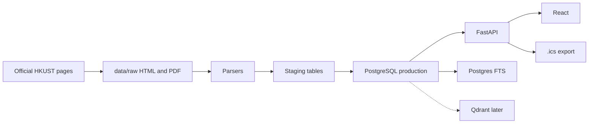
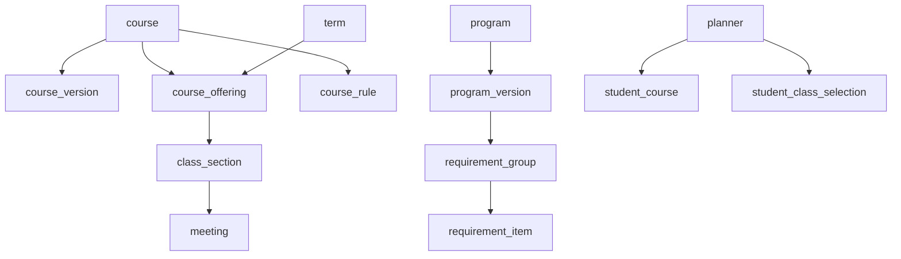

# HKUST Academic Planner (PostgreSQL system of record)

## Stack recommendation

**Replace the Ruby demo with FastAPI + React + PostgreSQL.** Keep the current parsers as a reference, not as a second backend.

The working demo in [`server.rb`](server.rb), [`lib/wcq.rb`](lib/wcq.rb), [`lib/sis_import.rb`](lib/sis_import.rb), and [`public/app.js`](public/app.js) already proves WCQ fetch, SIS paste, conflict highlighting, and `.ics` export. It cannot become the product: meetings live in `localStorage`, HTML is cached in process memory, and there is no versioned catalog.

| Option | Verdict |
|---|---|
| Keep Ruby, add Postgres beside it | Reject. Two backends, and Python is the better fit for SQLAlchemy, later Qdrant, and requirement parsing. |
| FastAPI + Postgres now, keep vanilla JS | Workable short-term, but a throwaway UI: the full schema already includes requirement trees and credit allocation, which vanilla JS will not scale into. |
| **FastAPI + React rewrite** | **Choose this.** The timetable UI is ~360 lines and can be recreated at parity while the backend becomes the system of record. Keep Ruby files until Python parsers match WCQ/SIS fixtures, then retire WEBrick. |

Qdrant remains auxiliary. Prerequisites, exclusions, and graduation rules live only in PostgreSQL.



## First-build scope (your choice)

Scaffold **all four phases in the schema**. Implement **catalog + timetable behavior** only.

- Implement: academic years, courses/versions, terms, offerings, sections, meetings, WCQ refresh, SIS paste import, search, conflicts, server-side `.ics`, anonymous planner profiles.
- Schema only (empty or stub APIs): programs, requirement trees, credit allocation, combination rules, Qdrant collections.
- Do not implement yet: degree-audit evaluator, Engineering `prog-crs` scrape as a product feature, semantic search, pathway recommendations.

## Privacy boundary

Keep the existing rule: **no HKUST passwords, no SIS login, no official student records.**

- **Catalog schema:** public course, program, and schedule data.
- **Planner schema:** manually entered / pasted / selected plans, keyed by a browser-issued `planner_id`, not an ITSC account.
- Same Postgres instance, two schemas (`catalog`, `planner`) so the split is real without operating two databases.

## Repo layout

```text
backend/                 FastAPI, SQLAlchemy 2, Alembic
  app/models/            catalog + planner tables
  app/ingestion/         WCQ, SIS paste, writes into data/raw/
  app/services/          search, conflicts, ics, rule parse
  app/api/               routers
frontend/                Vite + React (timetable + catalog search)
data/raw/                official HTML + PDFs, named by year
data/sample-sis.txt      existing SIS paste fixture
```

## Local Postgres (prototype: keep it simple)

No Docker Compose, no hosted database, no Qdrant container. Run Postgres on the machine (Homebrew on macOS is enough).

```text
createdb hkust_planner
DATABASE_URL=postgresql://localhost/hkust_planner
```

- Alembic migrations against that local database.
- `catalog` and `planner` remain two schemas in the same local instance — not two servers.
- `.env` with `DATABASE_URL`; do not commit secrets (local default has none).
- Docker/MinIO/cloud Postgres can wait until the prototype is actually deployed.

## Raw files (prototype: keep it simple)

No S3, MinIO, or content-hash blobs. Save crawled files on disk and store the path in Postgres.

```text
data/raw/
  2026-27/
    wcq-2610-COMP.html
    26-27comp.pdf
    26-27pw_idt.pdf
    26-27ssci_requirements.pdf
```

- `source_document.source_path` is a relative path such as `data/raw/2026-27/26-27comp.pdf`. Also keep `source_url` and `retrieved_at`.
- Do not put PDF/HTML bytes in PostgreSQL.
- Gitignore `data/raw/`. Do not commit official PDFs. Keep tiny parser fixtures elsewhere if tests need them.
- Overwrite on re-crawl is fine for the prototype. Re-run the parser after replacing a file.
- User uploads, if any, go in `data/raw/uploads/` or stay in the browser until needed.

Crawl, save the file, parse, write tables. That folder is the whole object store.

## Core schema (create now)

Follow the entity list in the architecture brief. Important modeling rules:

- Keep [`course`](server.rb) identity (`COMP` + `5711`) separate from [`course_version`](server.rb) (title, credits, description, source hash per academic year). Never overwrite history.
- Store meetings as rows, not `"TuTh 01:30PM-02:50PM"` strings. Port [`Wcq.parse_days_times`](lib/wcq.rb) into `meeting(weekday, start_time, end_time, start_date, end_date, timezone='Asia/Hong_Kong')`.
- Store both `course_rule.expression_json` (complex AND/OR/grade/standing) and `course_relationship` (simple prereq/exclusion/equivalent edges).
- Requirement groups are a tree (`parent_id`) with `requirement_item` rows. Evaluation code comes in Phase 3; tables exist now.
- `student_program.program_role` covers major / minor / extended_major / second_major / school_requirement. No special-case columns for IIM, double major, or broad-based admission.
- Ingestion: `source_document` (url + `source_path` into `data/raw/`), `ingestion_run`, `staging_course`, plus `parse_review_queue` for low-confidence prerequisite expressions. Never auto-delete old `course_version` rows; overwriting the raw file on disk is OK.



Indexes in the first migration: unique `(subject_code, course_number)`, unique `(offering_id, section_code)`, GIN `to_tsvector` on `course_version(title, description)`, and `pg_trgm` on `course_code`.

## Ingestion pipeline (Phase 1 behavior)

Source-to-normalized path:

```text
official page → data/raw file → parser → staging → validation → production → FTS
```

**Implemented first (current-term schedule, already proven in Ruby):**

- Source: [Class Schedule & Quota](https://w5.ab.ust.hk/wcq/cgi-bin/) (term `2610` = 2026-27 Fall; refreshed from SIS ~every 15 minutes).
- Port [`lib/wcq.rb`](lib/wcq.rb) to Python: term index, subject pages, course blocks, sections, quotas, remarks, meeting rows.
- Save original HTML under `data/raw/{year}/` (readable names, overwrite OK) before parse. Record URL, path, and `retrieved_at` on `source_document`.
- Upsert `course` / `course_version` from schedule attributes (description, units, pre/co-req, exclusion raw text).
- Short refresh for the current term (CLI + optional APScheduler). Skip Redis/Celery until there are multiple crawlers.

**Prerequisite parse (conservative):**

- Always keep `raw_text`.
- Parse common `AND` / `OR` / course-code patterns into `expression_json`.
- Emit simple `course_relationship` rows when confidence is high.
- Send ambiguous expressions to `parse_review_queue` with `confidence`. Do not guess graduation logic.

**Deferred to Phase 3 (tables ready):**

- [Undergraduate Course Catalog](https://registry.hkust.edu.hk/resource-library/course-catalog) / [prog-crs ugprog](https://prog-crs.hkust.edu.hk/ugprog) for intake-year program trees.
- First program scrape should be School of Engineering (COMP, COSC, AI, CPEG, plus minors/extended majors), because double-major and `program_role` storage is already in the schema.
- University rules that the evaluator must encode later: 120-credit minimum; Common Core not reusable with School/Major after 2022-23; additional-major 20-credit single-count rule.

## API and frontend (first build)

FastAPI replaces [`server.rb`](server.rb) endpoints, with persistence:

- `GET /api/term`, `/api/subject`, `/api/search` — from Postgres, not live HTML on every request.
- `POST /api/import` — port [`lib/sis_import.rb`](lib/sis_import.rb) (List View text, PeopleSoft HTML, section codes like `COMP 2011 L1`).
- `GET /api/sample` — keep [`data/sample-sis.txt`](data/sample-sis.txt).
- `GET /api/sources` — same privacy copy as today.
- New: `GET/PUT /api/plan` (planner selections), `GET /api/plan/conflicts`, `GET /api/plan.ics`, `POST /api/admin/ingest/wcq`.

React timetable should match current UX: SIS paste, sample student, catalog search, weekly grid, overlap flags, enrolled list, `.ics` download. Differences from the demo:

- Meetings persist in `planner.student_class_selection`, not only `localStorage`.
- `.ics` is generated on the server: one VEVENT per meeting pattern, `TZID=Asia/Hong_Kong`, real `DTSTART`/`UNTIL` from term/meeting dates (the demo hardcodes `20260921` and has no UNTIL).
- TBA rooms and missing times are stored and omitted from the grid/calendar rather than faked.

Conflict detection uses meeting rows (weekday + time overlap + date-range overlap). Section-matching rules stay in `remarks` for now; validation is Phase 2 polish.

## Phases after the first build

**Phase 2 polish:** section-matching validation, irregular dates, holidays, winter/summer terms, quota freshness.

**Phase 3 degree audit:** ingest `prog-crs` program versions by intake year; evaluate requirement trees against planned/completed courses; write `requirement_credit_allocation` so a course cannot be double-counted illegally; remaining-requirements view; Engineering first, then other schools.

**Phase 4 semantic search:** optional Qdrant (or pgvector). Embed course descriptions, requirement groups, and program text with metadata (`document_type`, `course_id`, `academic_year`). Always hydrate hits from PostgreSQL. Never store rules only as vectors.

## What we will not do

- Collect Connect / ITSC credentials or scrape Student Center.
- Treat Qdrant as the catalog.
- Store PDF/HTML bytes in PostgreSQL, S3, or MinIO.
- Commit official PDFs to git.
- Require Docker Compose, hosted Postgres, or Qdrant for the prototype.
- Delete historical `course_version` / `program_version` rows on refresh.
- Encode IIM / double major / extended major as one-off columns.
